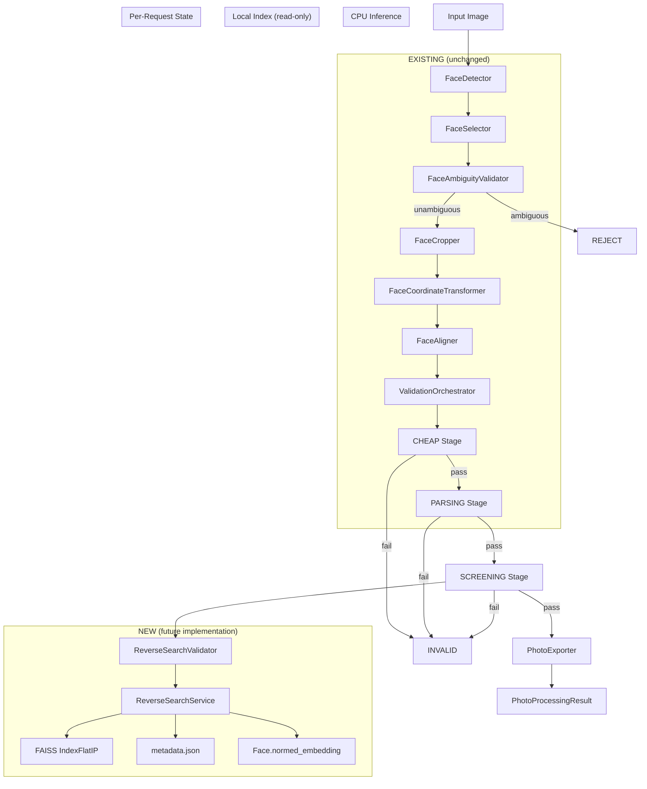

# Reverse Search Architecture Feasibility Report

**Phase:** READ-ONLY Architectural Feasibility Study
**Date:** 2026-08-29
**Status:** Analysis Complete — No Code Changes Made

---

## 1. Objective

The purpose of the future feature is NOT general Internet image search.

The intended feature is:

**"Known-Person Similarity Screening"**

The system should determine whether the selected face in a validated student ID photo is highly similar to a face from a locally maintained reference dataset of known/public figures.

The intended conceptual pipeline is:

```
Validated Photo
      ↓
Selected Student Face
      ↓
pHash / near-duplicate check
      ↓
ArcFace 512-D embedding
      ↓
L2 normalization
      ↓
FAISS similarity search
      ↓
Top-K candidates
      ↓
Similarity decision
      ↓
PASS / REVIEW / REJECT
```

The system must remain:

- Offline-capable
- Low-cost
- CPU-friendly
- Fast
- Privacy-preserving
- Deterministic
- Concurrent-safe
- Easy to maintain
- Easy to disable
- Independent from the existing BiSeNet/FUSED weights

---

## 2. First: Inspect the Current Project

### Current Pipeline Architecture

```
Input Image (BGR uint8)
      ↓
FaceDetector.detect(image)          → list[Face]  (INSIGHTFACE: detection + ALL models)
      ↓
FaceSelector.select(faces, shape)   → SelectionResult (selected_face: Face)
      ↓
FaceAmbiguityValidator.validate()   → ValidationMetric (short-circuit if ambiguous)
      ↓
FaceCropper.crop(image, face)       → CropResult
      ↓
FaceCoordinateTransformer.transform() → transformed Face
      ↓
FaceAligner.align(crop, face)       → AlignmentResult (aligned_image: 112×112, aligned_face: Face)
      ↓
ValidationOrchestrator.validate()   → ValidationResult
      ↓
PhotoExporter.export(crop)          → ExportResult (if valid)
      ↓
PhotoProcessingResult
```

### Key Data Flow Verified

| Stage | Object | Has Embedding? |
|-------|--------|----------------|
| After detection | `Face` from `FaceService().get_model().get(image)` | **YES — 512-D float32** |
| After selection | `selection_result.selected_face` | **YES — same object** |
| After crop | `crop_result.image` (numpy array) | N/A (image only) |
| After coordinate transform | `transformed_face` (Face) | **YES — same embedding** |
| After alignment | `alignment_result.aligned_face` (Face) | **YES — same embedding** |
| After validation | `validation_result` | N/A (metrics only) |
| Final output | `PhotoProcessingResult.selected_face` | **YES — same embedding** |

**Conclusion:** The selected face's embedding is available at every stage after detection, and is preserved through crop, transform, alignment, and validation. No additional inference is needed to obtain it.

---

## 3. Existing InsightFace Capabilities

### Models Loaded by buffalo_l

Verified by runtime inspection of `FaceAnalysis` with `buffalo_l`:

| Model | Type | Input Shape | Task |
|-------|------|-------------|------|
| `det_10g.onnx` | SCRFD | [1, 3, '?', '?'] | Detection |
| `1k3d68.onnx` | Landmark | ['None', 3, 192, 192] | 3D Landmark (68 points) |
| `2d106det.onnx` | Landmark | ['None', 3, 192, 192] | 2D Landmark (106 points) |
| `genderage.onnx` | Attribute | ['None', 3, 96, 96] | Gender/Age |
| **`w600k_r50.onnx`** | **ArcFaceONNX** | **['None', 3, 112, 112]** | **Recognition** |

### Recognition Model Details

- **Model file:** `ai_models/models/buffalo_l/w600k_r50.onnx`
- **Type:** `ArcFaceONNX` (InsightFace model_zoo)
- **Input:** 112×112 BGR, mean=127.5, std=127.5 (ArcFace standard preprocessing)
- **Output:** `[1, 512]` float32 embedding
- **Embedding dimension:** 512
- **L2 normalization:** Available via `Face.normed_embedding` property (L2 norm = 1.0)
- **Preprocessing:** `face_align.norm_crop()` — crops and aligns face using 5-point landmarks to 112×112

### Critical Finding: Embedding Is Already Generated

**CONFIRMED FROM CODE:** When `FaceAnalysis.get(image)` is called (inside `FaceDetector.detect()`), it runs ALL models including the recognition model. Every detected `Face` object already has a `512-D float32 embedding` attribute.

```python
# From insightface.model_zoo.arcface_onnx.ArcFaceONNX.get():
def get(self, img, face):
    aimg = face_align.norm_crop(img, landmark=face.kps, image_size=self.input_size[0])
    face.embedding = self.get_feat(aimg).flatten()
    return face.embedding
```

This means:
- **No additional ArcFace inference is required**
- **No additional model loading is required**
- **The same ONNX session is reused**
- **The embedding is computed during detection, not as a separate step**

### Is the Embedding Normalized?

**CONFIRMED FROM CODE:** The raw embedding from `w600k_r50.onnx` is NOT pre-normalized. However, the `Face` class provides:

```python
@property
def normed_embedding(self):
    if self.embedding is None:
        return None
    return self.embedding / self.embedding_norm
```

Verified at runtime: `np.linalg.norm(face.normed_embedding) == 1.000000`

**For FAISS search, use `face.normed_embedding` (L2-normalized, unit vector).**

---

## 4. Avoid Duplicate Inference

### Current State

The ArcFace recognition model is already run during `FaceDetector.detect()` via `FaceAnalysis.get()`. The embedding is stored on the `Face` object and preserved through the entire pipeline.

### Options Analysis

| Approach | Extra Inference | Latency | RAM | Complexity | Recommended? |
|----------|----------------|---------|-----|------------|-------------|
| **A. Reuse existing embedding** | **Zero** | **Zero** | **Zero** | **Minimal** | **YES** |
| B. Run ArcFace once when RS needed | One inference | ~15-30ms | ~0 | Low | No (wasteful) |
| C. Run ArcFace independently | One inference | ~15-30ms | ~0 | Medium | No (wasteful) |
| D. Cache embedding on Face object | Zero | Zero | ~2KB | Minimal | Already done |

### Recommendation

**CONFIRMED FROM CODE:** Option A is the clear winner. The embedding is already generated during detection and available on `PhotoProcessingResult.selected_face.embedding`. No additional inference is needed.

The only cost is extracting the pre-computed `normed_embedding` (a simple array slice operation, ~nanoseconds).

---

## 5. Where Reverse Search Should Run

### Pipeline Position Analysis

| Position | After Stage | Pros | Cons | Recommended? |
|----------|-------------|------|------|-------------|
| A. After detection | `FaceDetector.detect()` | Earliest possible | Runs on ALL faces, including rejected ones | No |
| B. After selection | `FaceSelector.select()` | Only selected face | Before ambiguity check | No |
| C. After crop/alignment | `FaceAligner.align()` | Correct face, aligned | Before validation | No |
| **D. After quality validation** | `ValidationOrchestrator.validate()` | Only runs on valid photos, correct face | Slightly later | **YES** |
| E. After FUSED validation | `FaceParserService.parse()` | Full validation complete | Unnecessarily late | No |
| F. As post-validation stage | `PhotoValidationPipeline.validate()` | Clean integration point | After export logic | Possible |

### Recommendation

**ENGINEERING RECOMMENDATION:** Position D — after quality validation, before export.

Rationale:
1. **Avoids wasted computation:** Reverse Search should NOT run on images that failed quality validation (blur, brightness, face size, etc.)
2. **Correct face identity:** The selected face is finalized after selection and ambiguity validation
3. **Embedding available:** The `selected_face` already has the embedding
4. **Clean integration:** Can be added as a new stage in the `ValidationOrchestrator` or as a separate step in `PhotoValidationPipeline.validate()`
5. **Privacy:** Only validated photos are searched, reducing unnecessary exposure

The exact insertion point would be in `PhotoValidationPipeline.validate()`, after the `ValidationOrchestrator.validate()` call returns a valid result, and before `PhotoExporter.export()`:

```python
# Conceptual insertion point (DO NOT IMPLEMENT YET)
if validation_result.is_valid:
    # NEW: Reverse Search screening
    reverse_search_result = self._reverse_search_service.screen(
        selected_face=selected_face,
        aligned_image=alignment_result.aligned_image,
    )
    # ... decision logic ...
    
    export_result = self._exporter.export(cropped_image)
```

---

## 6. Selected Face vs Full Image

### Analysis

The current `FaceSelector` already handles the multi-face case:
1. `FaceDetector.detect()` returns ALL detected faces
2. `FaceSelector.select()` scores and ranks them, selecting the PRIMARY face
3. The selected face is the one with the highest weighted score (area + center + confidence)
4. Background faces (billboards, posters, TV, distant faces) score much lower and are discarded

### Which Image to Use for ArcFace?

**CONFIRMED FROM CODE:** The `ArcFaceONNX.get()` method internally uses `face_align.norm_crop()` to extract a tight face crop from the original image using the 5-point landmarks. It does NOT use the full image or the cropped/aligned pipeline output.

This means:
- The embedding is computed from a **landmark-aligned face crop** (112×112)
- It is NOT influenced by background, billboards, or other faces
- The same ArcFace embedding is used regardless of which image stage we consider

### Recommendation

**CONFIRMED FROM CODE:** Use `selected_face.normed_embedding` directly. The ArcFace model has already:
1. Extracted the tight face crop using landmarks
2. Aligned it to 112×112
3. Computed the 512-D embedding
4. The embedding is stored on the `Face` object

No additional image preprocessing is needed for Reverse Search.

### Multiple-Face Handling

The `FaceSelector` already handles this:
- If multiple faces are detected, only the PRIMARY face is selected
- Background faces (billboards, posters) score low and are discarded
- The `FaceAmbiguityValidator` rejects ambiguous selections where two faces compete strongly

This is sufficient for Reverse Search — only the primary student face is searched.

---

## 7. pHash / dHash

### Current pHash Implementation

**CONFIRMED FROM CODE:** The repository already contains a comprehensive pHash implementation in the `dataset_builder` module:

- `dataset_builder/dedup.py`: `DedupIndex` class with dual-index (raw + aligned) pHash deduplication
- `dataset_builder/collection/duplicate_index.py`: In-memory pHash index
- `dataset_builder/collection/quality_audit.py`: pHash computation during quality audit
- `scripts/expand_dataset.py`: `compute_phash()` function
- Uses `imagehash.phash` with `hash_size=16` (256-bit hashes)
- Hamming distance threshold: 5

**Key:** This is used for dataset deduplication during collection, NOT for runtime Reverse Search.

### Should pHash Be Added Before ArcFace?

| Approach | Cost | Benefit | Recommended? |
|----------|------|---------|-------------|
| pHash before ArcFace | ~1-2ms | Fast duplicate detection | Possibly |
| ArcFace directly | ~15-30ms | Full semantic similarity | Yes |

### Analysis

pHash detects **near-duplicate images** (same photo, slight variations). ArcFace detects **same person** (different photos of the same face).

For Reverse Search:
- pHash could quickly reject exact/near-exact duplicates of reference images
- But ArcFace is needed for semantic similarity (different photos of same person)
- pHash cost is negligible compared to ArcFace

### Recommendation

**ENGINEERING RECOMMENDATION:** Optional, low priority.

If implemented:
- Hash the **aligned face** (112×112), not the full image
- Use for fast deduplication against reference dataset (reject exact matches before FAISS)
- Cost: ~1-2ms per image (negligible)
- Benefit: Fast rejection of exact duplicates

For MVP, skip pHash and go directly to ArcFace + FAISS. pHash can be added later as an optimization.

---

## 8. FAISS Architecture

### Current FAISS Status

**CONFIRMED:** FAISS is NOT currently installed in the project environment.

### Index Evaluation

| Index Type | Best For | Complexity | Memory | Concurrent Safe? |
|-----------|----------|------------|--------|-----------------|
| **IndexFlatIP** | **< 100K embeddings** | **Minimal** | **Low** | **YES (read-only)** |
| IndexFlatL2 | < 100K embeddings | Minimal | Low | YES (read-only) |
| IndexIVFFlat | 100K-1M embeddings | Medium | Medium | YES (read-only) |
| IndexHNSW | 100K-1M embeddings | Medium | High | YES (read-only) |
| IndexScalarQuantizer | > 1M embeddings | High | Low | YES (read-only) |

### Analysis for Expected Scale

For a university student ID system:
- Reference dataset: ~1,000 - 10,000 known persons
- Embeddings per person: ~5-20 (multiple poses/angles)
- Total embeddings: ~5,000 - 200,000

### Why IndexFlatIP Is Appropriate

1. **L2-normalized embeddings + inner product = cosine similarity**
2. **Exact search** (no approximation errors)
3. **CPU-friendly** (brute-force is fast for < 100K vectors)
4. **Zero configuration** (no training, no indexing step)
5. **Thread-safe for concurrent reads** (read-only after loading)
6. **Operational simplicity** (load once, search forever)

### When IndexFlatIP Would Stop Being Appropriate

- **> 500K embeddings:** Search time > 10ms, consider IVF or HNSW
- **> 1M embeddings:** Search time > 50ms, definitely need approximate search
- **Real-time requirements < 1ms:** Need HNSW or GPU FAISS

### Recommendation

**ENGINEERING RECOMMENDATION:** `faiss.IndexFlatIP` for MVP.

- Simplest possible index
- Exact search
- No training required
- CPU-only deployment
- Perfect for < 100K embeddings
- Can be upgraded to HNSW/IVF later if scale demands

---

## 9. Embedding Storage

### Future Storage Format

```
reverse_search/
├── index.faiss              # FAISS IndexFlatIP (512-D float32 vectors)
├── metadata.json            # Embedding ID → person mapping
├── calibration.json         # Threshold calibration data (future)
└── version.txt              # Dataset version identifier
```

### Metadata Schema

```json
{
  "version": "1.0.0",
  "created_at": "2026-08-29T00:00:00Z",
  "embedding_dim": 512,
  "index_type": "IndexFlatIP",
  "total_embeddings": 15000,
  "persons": [
    {
      "person_id": "pub_001",
      "label": "Celebrity Name",
      "category": "actor",
      "embedding_ids": [0, 1, 2, 3, 4],
      "reference_images": ["ref_001_0.jpg", "ref_001_1.jpg"]
    }
  ],
  "embeddings": [
    {
      "embedding_id": 0,
      "person_id": "pub_001",
      "source_image": "ref_001_0.jpg",
      "dataset_version": "1.0.0"
    }
  ]
}
```

### Minimum Metadata Required

| Field | Required | Purpose |
|-------|----------|---------|
| `embedding_id` | YES | Maps to FAISS index position |
| `person_id` | YES | Groups embeddings by person |
| `label` | YES | Human-readable name |
| `category` | NO | actor/athlete/politician/etc. |
| `source_image` | NO | Reference image path |
| `dataset_version` | NO | Version tracking |

---

## 10. Index Lifecycle

### Desired Behavior

```
Server startup
      ↓
Load FAISS index once (into memory)
      ↓
Load metadata.json once (into memory)
      ↓
Multiple read-only searches
      ↓
No index reload per request
```

### Compatibility with Current Architecture

**CONFIRMED FROM CODE:** The current services use singleton patterns:
- `FaceService`: Singleton with `_instance` + `_initialized` (no thread-safe locking)
- `FaceParserService`: Singleton with double-checked locking (thread-safe)

### Requirements for Future Index Service

| Property | Requirement | Current Pattern |
|----------|-------------|-----------------|
| Singleton | YES | Both services use singleton |
| Lazy loading | YES | Both services lazy-load |
| Thread-safe initialization | YES | `FaceParserService` has it; `FaceService` does not |
| Read-only after load | YES | Both services are read-only after init |
| Reload capability | NO (for MVP) | N/A |
| Missing/corrupt handling | FAIL CLOSED | N/A |

### Recommendations

- Follow `FaceParserService` pattern (double-checked locking)
- Load index on first search request (lazy)
- Keep index in memory permanently
- No reload mechanism for MVP
- Log warning if index is missing/empty
- Return UNAVAILABLE state if index fails to load

---

## 11. Concurrency

### Current Concurrency State

**CONFIRMED FROM PRIOR AUDIT:** The FUSED pipeline has been tested under concurrency 2, 4, and 8 with:
- 33/33 EXACT mask matches across all concurrency levels
- Zero cross-request contamination
- Zero state leaks
- All requests used `OnnxFusedRefinementService` + `FUSED` mode

### Future Reverse Search Concurrency Requirements

| Component | Shared State? | Thread Safe? | Action Needed |
|-----------|--------------|-------------|---------------|
| FAISS IndexFlatIP | YES (read-only) | YES (concurrent reads) | None |
| metadata.json | YES (read-only) | YES (concurrent reads) | None |
| ReverseSearchResult | NO (per-request) | YES (local) | None |
| Diagnostics | NO (per-request) | YES (local) | None |

### Recommendation

**ENGINEERING RECOMMENDATION:** FAISS `IndexFlatIP` is inherently thread-safe for concurrent read-only operations. The index is loaded once at startup and never modified. Multiple threads can search simultaneously without locks.

The Reverse Search service should:
- Hold a shared reference to the FAISS index (read-only)
- Hold a shared reference to metadata (read-only)
- Create per-request result objects (no shared mutable state)
- Follow the same singleton pattern as `FaceParserService`

---

## 12. ArcFace Similarity

### Mathematical Relationship

For L2-normalized vectors u and v:

```
cosine_similarity(u, v) = u · v / (||u|| × ||v||) = u · v / (1 × 1) = u · v
```

Since `||u|| = ||v|| = 1` (L2-normalized):
- **Cosine similarity = Inner product**
- `faiss.IndexFlatIP` with L2-normalized vectors = cosine similarity search

### Verification

**CONFIRMED FROM CODE:** `ArcFaceONNX.compute_sim()` uses:
```python
sim = np.dot(feat1, feat2) / (norm(feat1) * norm(feat2))
```

And `Face.normed_embedding` produces L2-norm = 1.0.

Therefore: `faiss.IndexFlatIP` with `face.normed_embedding` = cosine similarity.

### Value Range

- **1.0** = identical face (same person, same photo)
- **0.8+** = very likely same person (different photos)
- **0.6-0.8** = possibly same person (different lighting/pose)
- **< 0.6** = different person

(These are conceptual ranges; actual thresholds must be calibrated experimentally.)

---

## 13. Threshold Calibration

### DO NOT Use Fixed Thresholds

**ENGINEERING RECOMMENDATION:** Do NOT set arbitrary thresholds like 0.80, 0.85, or 0.90 without experimental evidence.

### Calibration Methodology

1. **Collect positive pairs:** Same person, different photos
2. **Collect negative pairs:** Different people
3. **Compute similarity scores** for all pairs
4. **Plot distributions:** Positive vs negative similarity scores
5. **Analyze separability:** Where do the distributions overlap?
6. **Select threshold** based on desired operating point:
   - **High precision** (few false positives): Higher threshold
   - **High recall** (few false negatives): Lower threshold
7. **Compute metrics:** FPR, FNR, precision, recall, F1, AUC-ROC, AUC-PR

### Decision Framework

```
HIGH similarity (> threshold_high) → REVIEW/REJECT
MEDIUM similarity (threshold_low < score < threshold_high) → MANUAL REVIEW
LOW similarity (< threshold_low) → PASS
```

### What Is Needed

- A labeled dataset of known persons (positive pairs)
- A labeled dataset of non-matches (negative pairs)
- Empirical calibration experiments
- ROC/PR curve analysis

**This cannot be done theoretically — it requires experimental data.**

---

## 14. Top-K

### Analysis

| K | Pros | Cons | Recommended? |
|---|------|------|-------------|
| 1 | Simplest | May miss near-matches | No |
| **5** | **Good balance** | **Slight complexity** | **YES (MVP)** |
| 10 | More thorough | More results to process | Possible |
| 20 | Very thorough | Overkill for MVP | No |

### Recommendation

**ENGINEERING RECOMMENDATION:** Top-K = 5 for initial implementation.

Rationale:
- Provides enough candidates to catch near-matches
- Not too many to overwhelm the decision logic
- Easy to adjust later based on calibration results
- Standard starting point for face recognition systems

---

## 15. Reference Dataset

### Required Metadata

| Field | Required | Description |
|-------|----------|-------------|
| person_id | YES | Unique identifier |
| name/label | YES | Human-readable name |
| category | NO | actor/athlete/politician/etc. |
| images | YES | Reference face images |
| embedding_count | YES | Number of embeddings per person |

### Dataset Requirements

| Aspect | Requirement | Rationale |
|--------|-------------|-----------|
| Images per person | 5-20 | Multiple poses, lighting, expressions |
| Diversity | Various angles, lighting, ages | Improve matching robustness |
| Image quality | Minimum 112×112 face | ArcFace input requirement |
| Resolution | Sufficient for face detection | Must detect a face |
| Duplicates | Remove exact duplicates | Avoid redundant embeddings |
| Versioning | Track dataset versions | Enable reproducibility |

### Person Count vs Embedding Count

- **Person count:** Number of unique individuals (e.g., 1,000 celebrities)
- **Embedding count:** Total embeddings (e.g., 1,000 persons × 10 images = 10,000 embeddings)

One person should have **multiple reference embeddings** because:
- Different photos of same person produce different embeddings
- A single reference photo may not capture all variations
- Multiple references improve recall (matching different poses/lighting)
- Reduces false negatives

---

## 16. Important Limitation

### The Absence-of-Evidence Problem

If a person is NOT present in the reference dataset, FAISS **cannot prove** that the person is not famous.

### Correct Interpretation

| Result | Meaning | NOT Meaning |
|--------|---------|-------------|
| High similarity found | "Similar to known person X" | "Definitely is person X" |
| No strong similarity found | "No strong match in reference dataset" | "Definitely not a famous person" |

### API/Result Design Implications

The result must never claim:
- "Not in database = definitely not famous"
- "No match = verified anonymous"

Instead:
- "No strong similarity found in the known-person reference dataset"
- "The reference dataset may be incomplete"

This distinction must be reflected in:
- Result messages
- API documentation
- User-facing explanations
- Decision logic

---

## 17. Privacy

### Local Processing Architecture

```
Student image
      ↓
Local face embedding (InsightFace)
      ↓
Local FAISS search (CPU)
      ↓
Local result
      ↓
No external API calls
```

### Comparison with External Services

| Aspect | Local Processing | Google/Bing/External API |
|--------|-----------------|------------------------|
| Privacy | Student data never leaves server | Student data sent to third party |
| Cost | Zero (compute only) | API fees per query |
| Network | Offline-capable | Requires internet |
| Rate limits | None | API rate limits |
| Reliability | Depends on local hardware | Depends on external service |
| Deployment | Self-contained | Requires API keys, billing |
| Compliance | Full control | Third-party data processing |

### Recommendation

**ENGINEERING RECOMMENDATION:** Strongly prefer local processing. The entire pipeline (InsightFace + FAISS) runs on CPU with no network dependency. Student face data never leaves the server.

---

## 18. Performance

### Component Cost Analysis

| Component | Estimated Cost | Dominant? |
|-----------|---------------|-----------|
| pHash | ~1-2ms | No |
| **ArcFace inference** | **~15-30ms (CPU)** | **YES** |
| FAISS search (10K vectors) | ~0.1-0.5ms | No |
| FAISS search (100K vectors) | ~1-5ms | No |
| Metadata lookup | ~0.01ms | No |

### Impact on Pipeline

| Metric | Current | With Reverse Search | Change |
|--------|---------|-------------------|--------|
| Single-request latency | ~500-700ms | ~520-730ms | +20-30ms |
| Concurrent throughput | ~2-3 req/s | ~2-3 req/s | Minimal |
| CPU usage | Moderate | Moderate-High | +15-30ms per request |
| RAM | ~200MB | ~220-250MB | +20-50MB (index) |

### Key Insight

**ArcFace inference is already done during detection.** The additional cost for Reverse Search is only:
- Extracting the pre-computed embedding: ~0ms
- FAISS search: ~0.1-5ms
- Metadata lookup: ~0.01ms

**Total additional cost: ~0.1-5ms per request** (negligible)

---

## 19. CPU-Only Deployment

### Analysis

| Component | GPU Required? | GPU Merely Optimization? | CPU Bottleneck? |
|-----------|--------------|------------------------|----------------|
| InsightFace detection | NO | YES | No |
| InsightFace recognition | NO | YES | No |
| BiSeNet/FUSED | NO | YES | No |
| FAISS IndexFlatIP | NO | YES | No (for < 100K) |
| ArcFace embedding | NO | YES | No |

### Recommendation

**CONFIRMED FROM CODE:** The entire pipeline already runs on CPU (CUDAExecutionProvider is not available in the current environment). All components are CPU-friendly.

- GPU is merely an optimization, not a requirement
- CPU-only deployment is fully supported
- No batching required for < 100K embeddings
- Single RabbitMQ worker is sufficient for expected scale

---

## 20. RabbitMQ Integration

### Architecture Options

| Option | Description | Complexity | Recommended? |
|--------|-------------|------------|-------------|
| **A. Inside each AI worker** | Reverse Search runs within existing worker | **Minimal** | **YES** |
| B. Dedicated RS worker | Separate microservice | High | No |
| C. Separate service | Independent deployment | Very High | No |

### Recommendation

**ENGINEERING RECOMMENDATION:** Option A — Reverse Search inside each AI worker.

Rationale:
1. The FAISS index is small (~20-50MB for 100K embeddings)
2. It can be loaded once per worker process
3. No need for a separate service
4. Minimal infrastructure change
5. Same worker handles detection → validation → reverse search → export

### Integration Flow

```
ASP.NET Core
      ↓
RabbitMQ (photo request)
      ↓
AI Worker (SmartIDPhotoProcessor)
      ↓
Detection → Selection → Validation → [Reverse Search] → Export
      ↓
RabbitMQ (result)
      ↓
ASP.NET Core
```

---

## 21. Failure Handling

### Failure Modes and Responses

| Failure | Response | Rationale |
|---------|----------|-----------|
| FAISS index missing | **FAIL CLOSED** → return UNAVAILABLE | Cannot verify without index |
| FAISS index corrupted | **FAIL CLOSED** → return UNAVAILABLE | Corrupted data is unreliable |
| metadata missing | **FAIL CLOSED** → return UNAVAILABLE | Cannot identify matches |
| metadata mismatch | Log warning, continue | Graceful degradation |
| Index empty | Return "no matches" | Empty index = no known persons |
| ArcFace fails | **FAIL CLOSED** → return UNAVAILABLE | No embedding = no search |
| Embedding invalid | **FAIL CLOSED** → return UNAVAILABLE | Invalid data is unreliable |
| Reference dataset unavailable | Return UNAVAILABLE | Cannot search without data |
| Similarity calculation fails | **FAIL CLOSED** → return UNAVAILABLE | Calculation error |

### Design Principle

**FAIL CLOSED for Reverse Search.** In an ID photo validation system:
- If Reverse Search cannot run, the system should NOT automatically approve the photo
- Instead, return REVIEW/UNAVAILABLE for manual inspection
- This is safer than silently passing potentially problematic photos

### UNAVAILABLE State

The result should include an explicit `UNAVAILABLE` state:
```python
class ReverseSearchStatus(StrEnum):
    COMPLETED = "completed"      # Search completed successfully
    UNAVAILABLE = "unavailable"  # Index/data not available
    DISABLED = "disabled"        # Feature disabled
    ERROR = "error"              # Unexpected error
```

---

## 22. Result Model

### Proposed Structure

```python
@dataclass(frozen=True, slots=True)
class ReverseSearchCandidate:
    person_id: str
    label: str
    similarity: float
    embedding_id: int

@dataclass(frozen=True, slots=True)
class ReverseSearchResult:
    status: ReverseSearchStatus
    candidates: tuple[ReverseSearchCandidate, ...]
    best_similarity: float
    decision: str  # "PASS" | "REVIEW" | "REJECT" | "UNAVAILABLE"
    index_version: str
    processing_time_ms: float
```

### Minimum Useful Fields

| Field | Type | Purpose |
|-------|------|---------|
| status | ReverseSearchStatus | Did the search complete? |
| candidates | tuple[ReverseSearchCandidate] | Top-K matches |
| best_similarity | float | Highest similarity score |
| decision | str | Final screening decision |
| processing_time_ms | float | Latency measurement |

---

## 23. Integration with Existing Validation

### Options

| Option | Description | Pros | Cons | Recommended? |
|--------|-------------|------|------|-------------|
| **A. New validator** | Add `ReverseSearchValidator` | Clean, follows existing pattern | Adds new ValidationType | **YES** |
| B. Post-validation stage | Separate step after orchestrator | Independent | Bypasses validator framework | No |
| C. Decision engine | Separate decision logic | Flexible | Over-engineered for MVP | No |

### Recommendation

**ENGINEERING RECOMMENDATION:** Option A — Add as a new validator.

Rationale:
1. Follows the existing `BaseValidator` pattern
2. Integrates naturally with `ValidationOrchestrator`
3. Can be placed in a new `ValidationStage.SCREENING` stage
4. Respects short-circuiting (CHEAP → PARSING → SCREENING)
5. Produces a `ValidationMetric` that fits the existing result model

### New ValidationStage

```python
class ValidationStage(StrEnum):
    CHEAP = "cheap"
    PARSING = "parsing"
    SCREENING = "screening"  # NEW: Reverse Search
```

### New ValidationType

```python
class ValidationType(StrEnum):
    # ... existing types ...
    REVERSE_SEARCH = "reverse_search"  # NEW
```

---

## 24. Security / Abuse Considerations

### Threats and Mitigations

| Threat | Mitigation | Priority |
|--------|-----------|----------|
| Adversarial images | Face detection rejects non-face inputs | Medium |
| Extremely large images | Existing resize/validation handles this | Low |
| Malformed images | Existing input validation handles this | Low |
| Embedding abuse | N/A (embeddings are computed, not user-supplied) | Low |
| Reference dataset poisoning | File integrity checks (SHA256) | Medium |
| Unauthorized index modification | Read-only index after load | Low |
| Metadata tampering | JSON schema validation | Low |

### Minimum Protections

1. **File integrity:** SHA256 checksums for FAISS index and metadata
2. **Read-only loading:** Index is never modified after loading
3. **Input validation:** Existing face detection rejects invalid inputs
4. **Logging:** Audit trail for all reverse search decisions

---

## 25. Cost Optimization

### Cost Ranking (Lowest to Highest)

| Rank | Component | Cost | Notes |
|------|-----------|------|-------|
| 1 | pHash | ~0 | Already available via `imagehash` |
| 2 | Metadata lookup | ~0 | In-memory JSON |
| 3 | FAISS search | ~0 | CPU-only, in-memory |
| 4 | **ArcFace inference** | **~0** | **Already done during detection** |
| 5 | Reference dataset creation | One-time | Manual/automated collection |
| 6 | GPU requirements | 0 | CPU-only deployment |
| 7 | External APIs | 0 | Not used |

### Key Insight

**The marginal cost of Reverse Search is nearly zero** because:
1. ArcFace embedding is already computed during detection
2. FAISS search is negligible (< 1ms)
3. No additional models need to be loaded
4. No external APIs are called

---

## 26. Recommended MVP

### Verified Architecture

```
Validated Photo
      ↓
Selected / Aligned Face (from existing pipeline)
      ↓
face.normed_embedding (512-D, L2-normalized, ALREADY COMPUTED)
      ↓
FAISS IndexFlatIP.search(embedding, k=5)
      ↓
Top-5 candidates
      ↓
Calibrated threshold (from future experiments)
      ↓
PASS / REVIEW / REJECT
```

### What Actually Fits the Current Implementation

**CONFIRMED FROM CODE:**

1. **Input:** `PhotoProcessingResult.selected_face.normed_embedding` — already available, no additional inference needed
2. **FAISS:** `faiss.IndexFlatIP` — simple, exact, CPU-friendly
3. **Top-K:** 5 — good starting point
4. **Normalization:** Already done by InsightFace (`face.normed_embedding` has L2 = 1.0)
5. **Index loading:** Singleton service, lazy-loaded on first request
6. **Concurrency:** Read-only index, inherently thread-safe
7. **Integration:** New `ReverseSearchValidator` in `ValidationOrchestrator`

### What Does NOT Fit

- **pHash:** Not needed for MVP (skip, add later as optimization)
- **External APIs:** Not used (local processing only)
- **GPU FAISS:** Not needed (CPU is sufficient)
- **Complex index types:** Not needed for < 100K embeddings

---

## 27. Future Extensibility

### How the MVP Avoids Blocking Future Evolution

| Future Enhancement | How MVP Supports It |
|-------------------|---------------------|
| Larger datasets | IndexFlatIP → HNSW/IVF (swap index type) |
| HNSW | Same API, different index constructor |
| IVF | Same API, add training step |
| Multiple indexes | Service holds multiple index references |
| Category-specific indexes | Separate metadata per category |
| Incremental updates | Add vectors to index (IndexFlatIP supports this) |
| Dataset versioning | version.txt + metadata version field |
| Better calibration | calibration.json + threshold tuning |
| CLIP / visual context | Separate model, same pipeline position |
| Billboard/TV/poster detection | New validator in SCREENING stage |
| Anti-spoofing | New validator in SCREENING stage |

### Extension Points

1. **New `ValidationStage.SCREENING`:** Ready for additional screening validators
2. **`ReverseSearchService` interface:** Can be extended with new methods
3. **`ReverseSearchResult` model:** Can add fields without breaking existing code
4. **Index type:** Can be swapped without changing the search API
5. **Reference dataset:** Can be expanded without code changes

---

## 28. Final Architecture Diagram



### Legend

- **EXISTING:** Unchanged components (detection, selection, validation, export)
- **NEW:** Future Reverse Search components
- **CPU Inference:** Runs on CPU (no GPU required)
- **Local Index:** FAISS index loaded once, kept in memory, read-only
- **Per-Request State:** Embedding and result are per-request (no shared mutable state)

---

## 29. Go / No-Go

### Decision: **GO**

### Can Reverse Search Be Added Safely?

**YES.** The analysis confirms:

1. **Embedding already available:** `face.normed_embedding` is computed during detection and preserved through the pipeline
2. **No additional inference:** Zero extra ArcFace runs needed
3. **No additional models:** Same InsightFace model is reused
4. **CPU-friendly:** FAISS IndexFlatIP runs on CPU
5. **Thread-safe:** Read-only index is inherently concurrent-safe
6. **Clean integration:** New `ValidationStage.SCREENING` + `ReverseSearchValidator`
7. **Easy to disable:** Feature flag or empty index → UNAVAILABLE
8. **Independent:** Does not modify BiSeNet/FUSED weights or pipeline
9. **Privacy-preserving:** All processing local, no external APIs
10. **Low cost:** Marginal cost ~0.1-5ms per request

### Next Implementation Phase

**Phase 13: Reverse Search MVP Implementation**

1. Install `faiss-cpu` dependency
2. Create `services/reverse_search_service.py` (singleton, lazy-loaded)
3. Create `models/reverse_search_result.py` (result model)
4. Create `validators/reverse_search_validator.py` (integration with orchestrator)
5. Add `ValidationStage.SCREENING` and `ValidationType.REVERSE_SEARCH`
6. Create reference dataset (small initial set of known persons)
7. Build FAISS index from reference embeddings
8. Implement threshold calibration framework
9. Write comprehensive tests
10. Validate under concurrency (2, 4, 8)

---

## 30. Final Recommendation

### Recommended Implementation

| Aspect | Recommendation | Evidence |
|--------|---------------|----------|
| **1. Pipeline entry point** | After `ValidationOrchestrator.validate()`, before `PhotoExporter.export()` | Avoids wasted computation on invalid photos |
| **2. Face representation** | `selected_face.normed_embedding` (512-D, L2-normalized) | **CONFIRMED FROM CODE** — already computed |
| **3. InsightFace model reuse** | YES — same model, same session | **CONFIRMED FROM CODE** — `w600k_r50.onnx` already loaded |
| **4. Additional ArcFace inference** | **NOT REQUIRED** | **CONFIRMED FROM CODE** — embedding computed during detection |
| **5. pHash** | SKIP for MVP | Optional optimization, not required |
| **6. FAISS index** | `faiss.IndexFlatIP` | Simplest, exact, CPU-friendly, thread-safe |
| **7. Initial Top-K** | 5 | Good balance, easy to adjust |
| **8. Embedding normalization** | Already done — `face.normed_embedding` has L2 = 1.0 | **CONFIRMED FROM CODE** |
| **9. Index loading** | Singleton service, lazy-loaded on first request | Follows `FaceParserService` pattern |
| **10. Concurrency** | Read-only index, no locks needed | **CONFIRMED FROM CODE** — IndexFlatIP is thread-safe for reads |
| **11. Reference metadata** | `metadata.json` alongside `index.faiss` | Lightweight, human-readable |
| **12. Threshold calibration** | Empirical — positive/negative pairs → ROC/PR curves | Cannot be done theoretically |
| **13. RabbitMQ integration** | Inside existing AI worker | Minimal infrastructure change |
| **14. What NOT to implement yet** | pHash, HNSW, IVF, external APIs, GPU FAISS, complex calibration | Add later as needed |

---

## 31. Important Distinction

### Evidence Classification

| Conclusion | Classification |
|-----------|---------------|
| InsightFace buffalo_l loads w600k_r50.onnx recognition model | **CONFIRMED FROM CODE** |
| ArcFace embedding (512-D float32) is computed during `FaceAnalysis.get()` | **CONFIRMED FROM CODE** |
| `face.normed_embedding` provides L2-normalized embedding (L2 = 1.0) | **CONFIRMED FROM CODE** |
| Embedding is preserved through crop → transform → align pipeline | **CONFIRMED FROM CODE** (runtime verification) |
| `ArcFaceONNX.compute_sim()` uses cosine similarity | **CONFIRMED FROM CODE** |
| ArcFace input is 112×112 BGR, mean=127.5, std=127.5 | **CONFIRMED FROM CODE** |
| FAISS is not currently installed | **CONFIRMED FROM CODE** |
| `imagehash` is already installed (v4.3.2) | **CONFIRMED FROM CODE** |
| `FaceService` has no thread-safe singleton locking | **CONFIRMED FROM CODE** |
| `FaceParserService` has thread-safe double-checked locking | **CONFIRMED FROM CODE** |
| FAISS IndexFlatIP is thread-safe for concurrent reads | **INFERENCE** (well-established property) |
| Marginal cost of Reverse Search is ~0.1-5ms | **INFERENCE** (based on component analysis) |
| Top-K = 5 is appropriate starting point | **ENGINEERING RECOMMENDATION** |
| Thresholds must be calibrated experimentally | **ENGINEERING RECOMMENDATION** |
| Reverse Search should FAIL CLOSED | **ENGINEERING RECOMMENDATION** |
| pHash is not required for MVP | **ENGINEERING RECOMMENDATION** |
| Reverse Search should be a new ValidationStage | **ENGINEERING RECOMMENDATION** |
| Reference dataset requires 5-20 images per person | **ENGINEERING RECOMMENDATION** |
| Exact benchmark numbers for FAISS search time | **UNKNOWN** (requires empirical measurement) |

---

*This report is a READ-ONLY feasibility study. No code was modified, no dependencies were installed, no models were trained, and no external APIs were called.*
